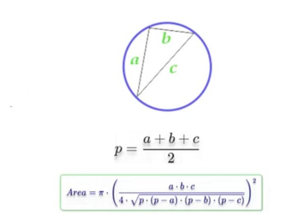

# Problem #23: Circle Area Circle Described Around an Arbitrary Triangle

## 📝 Problem Description

Write a program to calculate the **Area of a Circle** circumscribed around an arbitrary triangle with sides **a**, **b**, and **c**.

> **The Formula:**
> First, calculate the semi-perimeter: $p = \frac{a + b + c}{2}$
> Then, use the formula: $Area = \pi \times \left( \frac{a \times b \times c}{4 \sqrt{p(p-a)(p-b)(p-c)}} \right)^2$

**Example:**

- If sides are: `a = 5, b = 6, c = 7`
- The Output will be approximately: `38.48`

---

## 🛠️ Algorithm Steps (Logic)

This problem involves multiple steps to find the radius of the circumcircle first:

1. **Input:** Read three sides of the triangle: `A`, `B`, and `C`.
2. **Calculate Semi-perimeter ($p$):** - $p = (A + B + C) / 2$
3. **Calculate the Area of the Circle:**
   - Use the formula: $T = \frac{A \times B \times C}{4 \times \sqrt{p \times (p - A) \times (p - B) \times (p - C)}}$
   - $Result = \pi \times T^2$
4. **Output:** Print the final `Area`.

---

## 📊 Performance Insight

The complexity is **$O(1)$** as it uses a direct mathematical formula. However, it is computationally "heavier" than basic area formulas due to the square root and multiple multiplications.

---

## 📈 Flowchart Logic

1. **Start**
2. **Input:** `Read A, B, C`
3. **Process 1:** `P = (A + B + C) / 2`
4. **Process 2:** - `Radius = (A * B * C) / (4 * Sqrt(P * (P - A) * (P - B) * (P - C)))`
   - `Area = PI * (Radius * Radius)`
5. **Output:** `Print Area`
6. **End**

