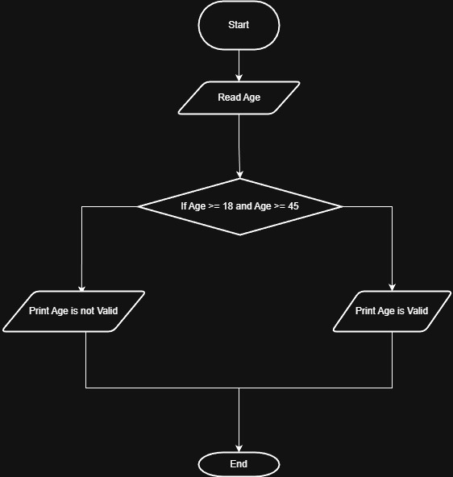

# Problem #24: Check Age If Valid for Work

## 📝 Problem Description

Write a program that asks the user to enter their **Age**. The program should check if the age is between **18** and **45** (inclusive). If it is, print "Accepted", otherwise print "Rejected".

**Example:**

- If the age is: `25` -> Output: `Accepted`
- If the age is: `15` -> Output: `Rejected`
- If the age is: `50` -> Output: `Rejected`

---

## 🛠️ Algorithm Steps (Logic)

To determine if the age is within the valid range, we use a logical comparison:

1. **Input:** Ask the user to enter their `Age`.
2. **Read:** Store the value in a variable.
3. **Decision:** Check if `Age >= 18` AND `Age <= 45`.
4. **Output:** - If the condition is true, print "Accepted".
   - If the condition is false, print "Rejected".

---

## 📊 Flowchart Logic

1. **Start**
2. **Input:** `Read Age`
3. **Decision (Diamond):** `Is Age >= 18 AND Age <= 45?`
   - **Yes:** `Print "Accepted"`
   - **No:** `Print "Rejected"`
4. **End**

---

## 🖼️ Solution

