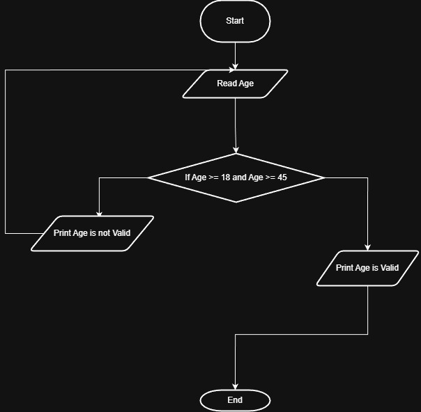

# Problem #25: Read Until Age is Between 18 and 45

## 📝 Problem Description

Write a program that asks the user to enter their **Age**. If the age is NOT between **18** and **45**, the program should print "Invalid Age" and ask the user to enter the age again. The program should only stop when a valid age is entered.

**Example:**

- Enter Age: `15` -> Output: `Invalid Age`
- Enter Age: `50` -> Output: `Invalid Age`
- Enter Age: `25` -> Output: (Program ends or moves to next step)

---

## 🛠️ Algorithm Steps (Logic)

This problem uses a "Loop" (تكرار) to ensure the input is valid:

1. **Input:** Ask the user to enter their `Age`.
2. **Read:** Store the value.
3. **Decision/Loop:** Check if `Age < 18` OR `Age > 45`.
   - If **True** (Invalid): Print "Invalid Age" and go back to Step 1.
   - If **False** (Valid): Stop the loop and print "Accepted".
4. **Output:** Print "Accepted" once the loop finishes.

---

## 📊 Flowchart Logic

1. **Start**
2. **Input:** `Read Age`
3. **Decision (Diamond):** `Is Age < 18 OR Age > 45?`
   - **Yes (True):** - `Print "Invalid Age"`
     - (Arrow goes back to "Read Age")
   - **No (False):**
     - `Print "Accepted"`
4. **End**

---

## 🖼️ Solution

