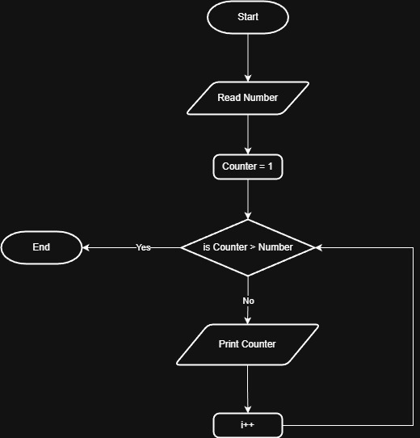

# Problem #26: Print Numbers from 1 to N

## 📝 Problem Description

Write a program to print numbers from 1 to N, where N is entered by the user.

**Example:**

- If the user enters N: `5`
- The Output will be:
  `1`
  `2`
  `3`
  `4`
  `5`

---

## 🛠️ Algorithm Steps (Logic)

To solve this, we use a counter that starts from 1 and increments in each step until it reaches N:

1. **Input:** Ask the user to enter the number `N`.
2. **Read:** Store the value in variable `N`.
3. **Initialization:** Let the counter `i = 1`.
4. **Loop/Decision:** - Check if `i <= N`.
   - If **True**: 
     - Print `i`.
     - Increment `i` by 1 (`i = i + 1`).
     - Go back to the start of the decision.
   - If **False**: Stop.

---

## 📊 Flowchart Logic

1. **Start**
2. **Input:** `Read N`
3. **Process:** `i = 1`
4. **Decision (Diamond):** `Is i <= N?`
   - **Yes:** - `Print i`
     - `i = i + 1`
     - (Arrow goes back to the decision)
   - **No:**
     - (End)
5. **End**

---

## 🖼️ Solution

