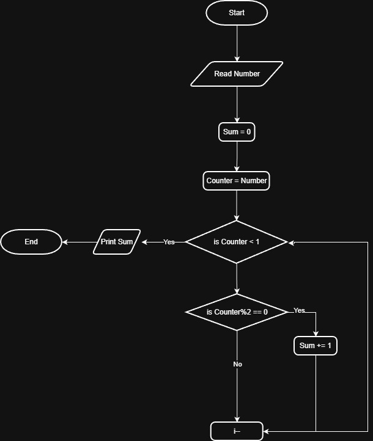

# Problem #29: Sum Even Numbers from 1 to N

## 📝 Problem Description

Write a program to calculate the sum of even numbers from 1 to N, where N is entered by the user.

**Example:**

- If the user enters N: `10`
- The even numbers are: `2, 4, 6, 8, 10`
- The Output (Sum) will be: `30`

---

## 🛠️ Algorithm Steps (Logic)

To solve this, we iterate from 1 to N and add only the numbers that are divisible by 2 to our total sum:

1. **Input:** Ask the user to enter `N`.
2. **Read:** Store the value in variable `N`.
3. **Initialization:** - Let the counter `i = 1`.
   - Let the total sum `Sum = 0`.
4. **Loop/Decision:** - Check if `i <= N`.
   - If **True**:
     - Check if `i` is even (e.g., `i % 2 == 0`).
     - If even: `Sum = Sum + i`.
     - `i = i + 1`.
     - Go back to the loop decision.
   - If **False**: Stop.
5. **Output:** Print the final `Sum`.

---

## 📊 Flowchart Logic

1. **Start**
2. **Input:** `Read N`
3. **Process:** `Sum = 0`, `i = 1`
4. **Decision (Diamond):** `Is i <= N?`
   - **Yes:** - **Decision:** `Is i Even?`
       - **Yes:** `Sum = Sum + i`
            - `i = i + 1`
            - (Arrow goes back to the loop decision)
   - **No:**
     - `Print Sum`
5. **End**

---

## 🖼️ Solution

