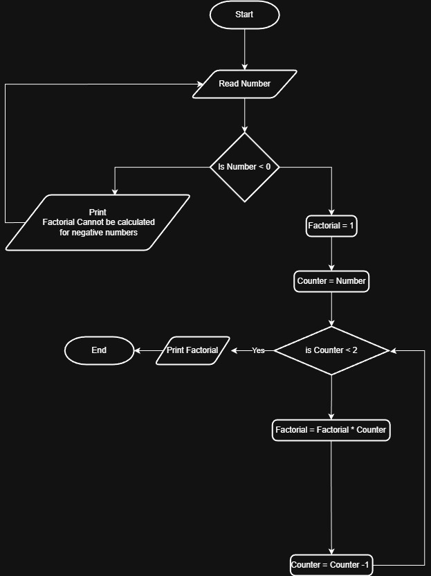

# Problem #30: Factorial of N

## 📝 Problem Description

Write a program to calculate the factorial of a non-negative integer N.
*(Note: Factorial of N (N!) is the product of all positive integers less than or equal to N. For example, 5! = 5 * 4 * 3 * 2 * 1 = 120).*

**Example:**

- If the user enters N: `5`
- The Output (Factorial) will be: `120`

---

## 🛠️ Algorithm Steps (Logic)

To calculate the factorial, we use a loop that multiplies numbers progressively:

1. **Input:** Ask the user to enter a positive number `N`.
2. **Read:** Store the value in variable `N`.
3. **Initialization:** - Let the counter `i = N`.
   - Let the result `Factorial = 1`.
4. **Loop/Decision:**
   - Check if `i > 0`.
   - If **True**:
     - `Factorial = Factorial * i`.
     - `i = i - 1` (Decrement).
     - Go back to the loop decision.
   - If **False**: Stop the loop.
5. **Output:** Print the final `Factorial` value.

---

## 📊 Flowchart Logic

1. **Start**
2. **Input:** `Read N`
3. **Process:** `Factorial = 1`, `i = N`
4. **Decision (Diamond):** `Is i > 0?`
   - **Yes:** - `Factorial = Factorial * i`
     - `i = i - 1`
     - (Arrow goes back to the loop decision)
   - **No:**
     - `Print Factorial`
5. **End**

---

## 🖼️ Solution

