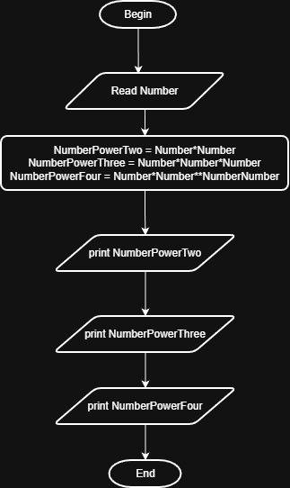

# Problem #31: Power of 2, 3, 4

## 📝 Problem Description

Write a program to ask the user to enter a number, then print its power of 2, 3, and 4.

**Example:**

- If the user enters: `3`
- The Output will be:
  `9` (3^2)
  `27` (3^3)
  `81` (3^4)

---

## 🛠️ Algorithm Steps (Logic)

To calculate the power, you multiply the number by itself for the required number of times:

1. **Input:** Ask the user to enter a number `N`.
2. **Read:** Store the value in variable `N`.
3. **Processing:** - $P2 = N * N$
   - $P3 = N * N * N$
   - $P4 = N * N * N * N$
4. **Output:** Print $P2$, $P3$, and $P4$.

---

## 📊 Flowchart Logic

1. **Start**
2. **Input:** `Read N`
3. **Process:** - `P2 = N * N`
   - `P3 = P2 * N`
   - `P4 = P3 * N`
4. **Output:** `Print P2, P3, P4`
5. **End**

---

## 🖼️ Solution

