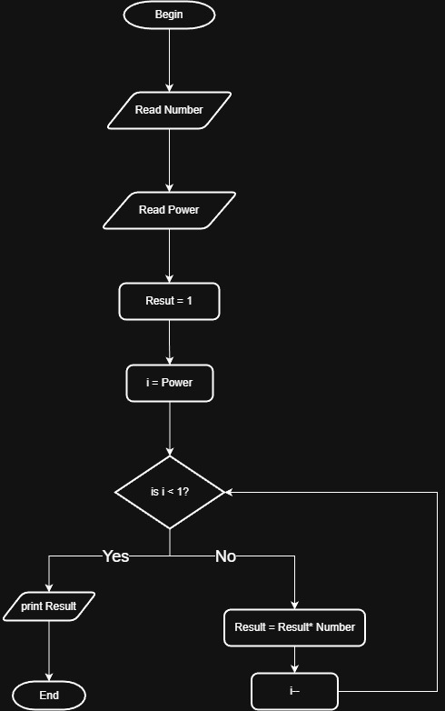

# Problem #32: Power of M

## 📝 Problem Description

Write a program to ask the user to enter a number (Number) and its power (M), then calculate and print the result.

**Example:**

- If Number = `2` and M = `3`
- The Output will be: `8` (2 *2* 2)

---

## 🛠️ Algorithm Steps (Logic)

To calculate $Number^M$, we need to multiply the "Number" by itself "M" times:

1. **Input:** Ask the user to enter `Number` and its power `M`.
2. **Read:** Store them in variables.
3. **Initialization:** - Let the result `P = 1`.
   - Let the counter `i = 1`.
4. **Loop/Decision:** - Check if `i <= M`.
   - If **True**:
     - `P = P * Number`.
     - `i = i + 1`.
     - Go back to the loop decision.
   - If **False**: Stop.
5. **Output:** Print the final result `P`.

---

## 📊 Flowchart Logic

1. **Start**
2. **Input:** `Read Number, M`
3. **Process:** `P = 1`, `i = 1`
4. **Decision (Diamond):** `Is i <= M?`
   - **Yes:** - `P = P * Number`
     - `i = i + 1`
     - (Arrow goes back to the loop decision)
   - **No:**
     - `Print P`
5. **End**

---

## 🖼️ Solution

