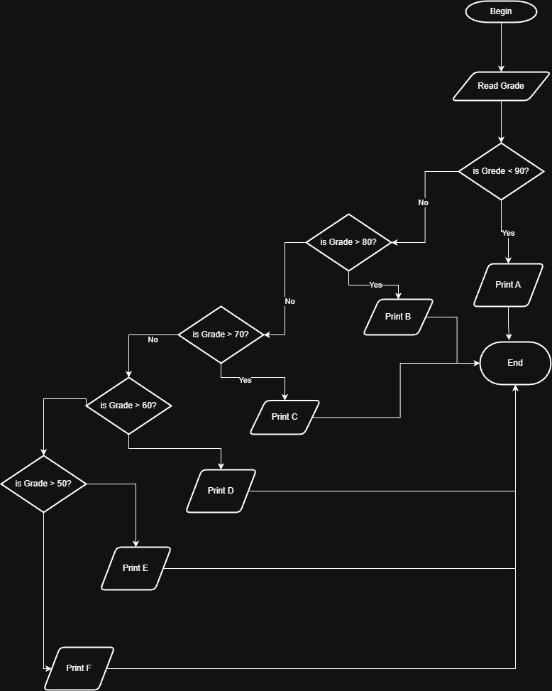

# Problem #33: Grade Letter (A, B, C, D, E, F)

## 📝 Problem Description

Write a program that asks the user to enter their **Grade** (from 0 to 100) and prints the corresponding letter according to the following rules:

- **90 - 100**: Print **A**
- **80 - 89**: Print **B**
- **70 - 79**: Print **C**
- **60 - 69**: Print **D**
- **50 - 59**: Print **E**
- **0 - 49**: Print **F**

**Example:**

- Input: `85` -> Output: `B`
- Input: `45` -> Output: `F`

---

## 🛠️ Algorithm Steps (Logic)

1. **Input:** Ask the user to enter the `Grade`.
2. **Read:** Store the value in a variable.
3. **Decision (Multi-Condition):**
   - Check if `Grade >= 90`: Print "A".
   - Else if `Grade >= 80`: Print "B".
   - Else if `Grade >= 70`: Print "C".
   - Else if `Grade >= 60`: Print "D".
   - Else if `Grade >= 50`: Print "E".
   - Else: Print "F".

---

## 📊 Flowchart Logic

1. **Start**
2. **Input:** `Read Grade`
3. **Decisions:**
   - `Grade >= 90?` -> Yes: `Print A` -> End
   - `Grade >= 80?` -> Yes: `Print B` -> End
   - `Grade >= 70?` -> Yes: `Print C` -> End
   - `Grade >= 60?` -> Yes: `Print D` -> End
   - `Grade >= 50?` -> Yes: `Print E` -> End
   - No: `Print F` -> End
4. **End**

---

## 🖼️ Solution

