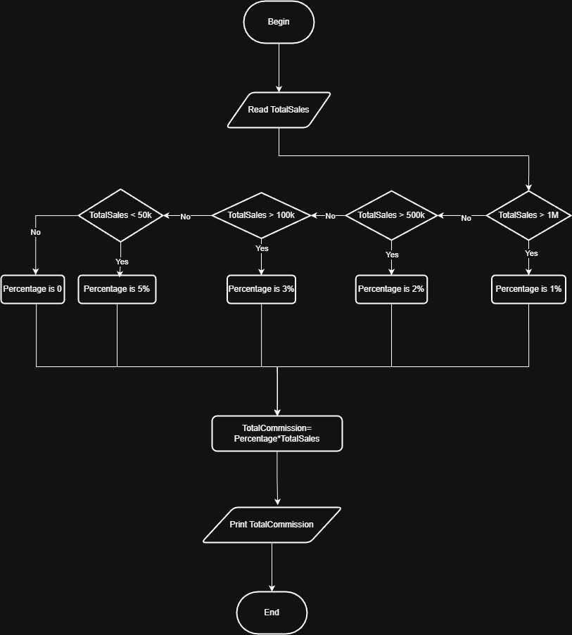

# Problem #34: Commission Sales

## 📝 Problem Description

Write a program that asks the user to enter their **Total Sales** and calculates the commission percentage and the final commission amount based on the following rules:

- **Sales > 1,000,000**: Commission is **1%**
- **Sales > 500,000 to 1,000,000**: Commission is **2%**
- **Sales > 100,000 to 500,000**: Commission is **3%**
- **Sales > 50,000 to 100,000**: Commission is **5%**
- **Otherwise**: Commission is **0%**

**Example:**

- If Total Sales = `100,000` -> Output: `5,000` (5%)
- If Total Sales = `1,200,000` -> Output: `12,000` (1%)

---

## 🛠️ Algorithm Steps (Logic)

1. **Input:** Ask the user to enter `TotalSales`.
2. **Read:** Store the value.
3. **Decision (Multi-Condition):**
   - If `TotalSales > 1,000,000`: `Percentage = 0.01`
   - Else if `TotalSales > 500,000`: `Percentage = 0.02`
   - Else if `TotalSales > 100,000`: `Percentage = 0.03`
   - Else if `TotalSales > 50,000`: `Percentage = 0.05`
   - Else: `Percentage = 0.00`
4. **Processing:** `Commission = TotalSales * Percentage`
5. **Output:** Print the `Commission`.

---

## 📊 Flowchart Logic

1. **Start**
2. **Input:** `Read TotalSales`
3. **Decisions:** Check ranges from highest to lowest to apply the correct percentage.
4. **Calculation:** `Commission = TotalSales * Percentage`
5. **Output:** `Print Commission`
6. **End**

---

## 🖼️ Solution

