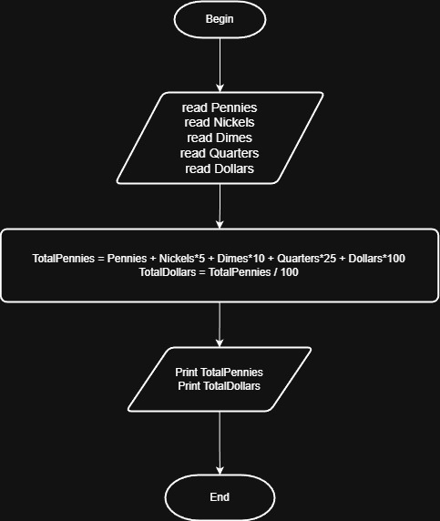

# Problem #35: Piggy Bank Calculator

## 📝 Problem Description

Write a program that asks the user to enter the total counts of:

- **Pennies** (1 Cent)
- **Nickels** (5 Cents)
- **Dimes** (10 Cents)
- **Quarters** (25 Cents)
- **Dollars** (100 Cents)

The program should calculate the total amount in **Pennies** and **Dollars**.

**Example:**

- If you have: `5 Pennies, 5 Nickels, 5 Dimes, 5 Quarters, 5 Dollars`
- The Output will be:
  - `Total Pennies = 705`
  - `Total Dollars = 7.05`

---

## 🛠️ Algorithm Steps (Logic)

To find the total, we multiply each coin count by its value in pennies:

1. **Input:** Ask the user to enter `Pennies`, `Nickels`, `Dimes`, `Quarters`, and `Dollars`.
2. **Read:** Store these 5 values.
3. **Processing:**
   - `TotalPennies = (Pennies * 1) + (Nickels * 5) + (Dimes * 10) + (Quarters * 25) + (Dollars * 100)`
   - `TotalDollars = TotalPennies / 100`
4. **Output:** Print `TotalPennies` and `TotalDollars`.

---

## 📊 Flowchart Logic

1. **Start**
2. **Input:** `Read Pennies, Nickels, Dimes, Quarters, Dollars`
3. **Calculation:**
   - `Sum = (P * 1) + (N * 5) + (D * 10) + (Q * 25) + (Dol * 100)`
4. **Output:** `Print Sum (Pennies)`, `Print Sum / 100 (Dollars)`
5. **End**

---

## 🖼️ Solution

