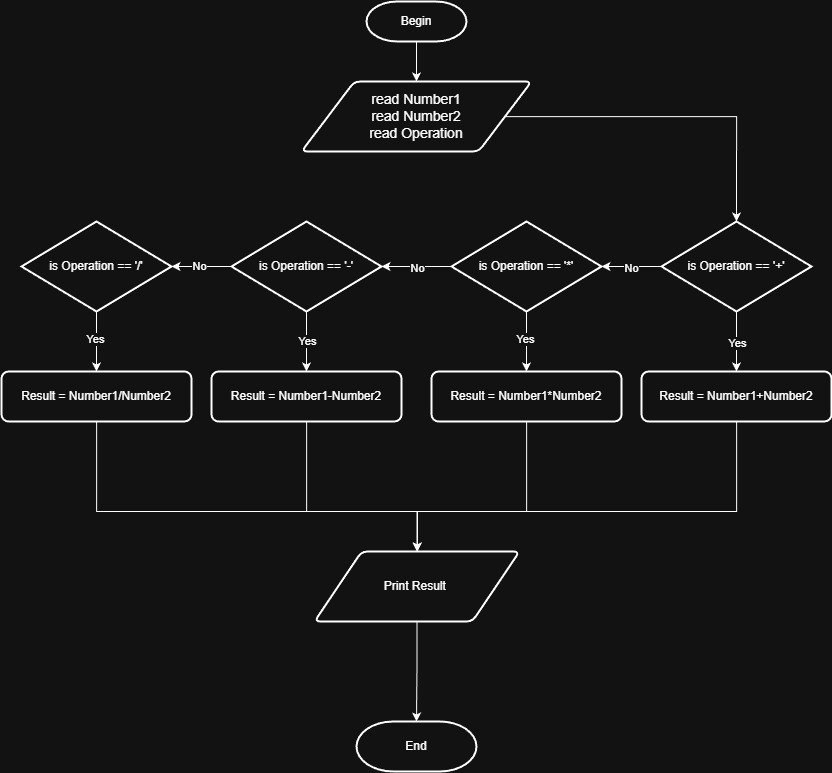

# Problem #36: Simple Calculator

## 📝 Problem Description

Write a program that asks the user to enter:

1. **Number1**
2. **Number2**
3. **Operation Type** (Example: `+`, `-`, `*`, `/`)

The program should perform the operation and print the result.

**Example:**

- Number1: `10`, Number2: `5`, Operation: `*` -> Output: `50`
- Number1: `20`, Number2: `4`, Operation: `/` -> Output: `5`

---

## 🛠️ Algorithm Steps (Logic)

المبدأ هنا هو "الاختيار" بناءً على الرمز الذي يدخله المستخدم:

1. **Input:** Ask the user for `N1`, `N2`, and `OpType`.
2. **Read:** Store them in variables.
3. **Decision (Multi-Condition):**
   - If `OpType == '+'`: `Result = N1 + N2`
   - Else if `OpType == '-'`: `Result = N1 - N2`
   - Else if `OpType == '*'`: `Result = N1 * N2`
   - Else if `OpType == '/'`: `Result = N1 / N2`
   - Else: Print "Invalid Operation"
4. **Output:** Print the `Result`.

---

## 📊 Flowchart Logic

1. **Start**
2. **Input:** `Read N1, N2, OpType`
3. **Decisions (Chain of Diamonds):**
   - `Op == '+'?` -> Yes: `Res = N1 + N2`
   - `Op == '-'?` -> Yes: `Res = N1 - N2`
   - `Op == '*'?` -> Yes: `Res = N1 * N2`
   - `Op == '/'?` -> Yes: `Res = N1 / N2`
4. **Output:** `Print Res`
5. **End**

---

## 🖼️ Solution

