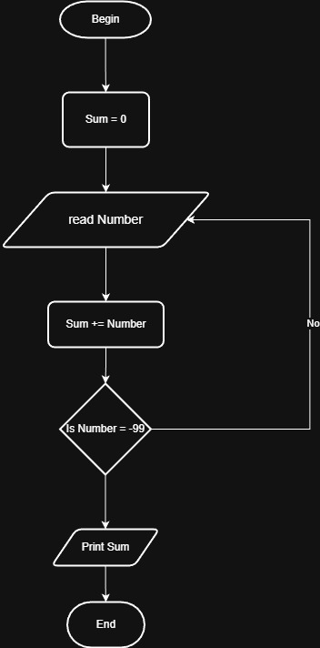

# Problem #37: Sum Until -99

## 📝 Problem Description

Write a program that asks the user to enter numbers and calculates their sum. The program should stop and print the total sum only when the user enters the number **-99**.

**Example:**

- Enter Number: `10`
- Enter Number: `20`
- Enter Number: `5`
- Enter Number: `-99`
- **Output:** `Sum = 35`

---

## 🛠️ Algorithm Steps (Logic)

هنا نحتاج إلى "حصالة" (Sum) تبدأ من صفر، ونستمر في إضافة الأرقام إليها طالما أن الرقم المدخل ليس -99:

1. **Initialization:** Let `Sum = 0`.
2. **Input:** Ask the user to enter a `Number`.
3. **Read:** Store the value.
4. **Loop/Decision:**
   - Check if `Number == -99`?
   - **Yes (True):** Stop the loop and go to Step 6.
   - **No (False):** - `Sum = Sum + Number` (Add the number to the total).
     - Go back to Step 2 (Ask for another number).
5. **Output:** Print the final `Sum`.

---

## 📊 Flowchart Logic

1. **Start**
2. **Process:** `Sum = 0`
3. **Input:** `Read Number`
4. **Decision (Diamond):** `Is Number == -99?`
   - **Yes:** `Print Sum` -> **End**
   - **No:** - `Sum = Sum + Number`
     - (Arrow goes back to "Read Number")
5. **End**

---

## 🖼️ Solution

