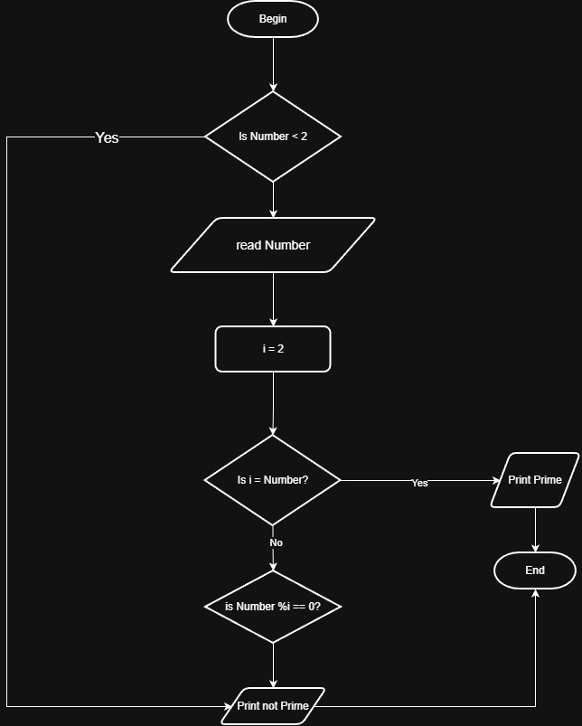

# Problem #38: Check Prime Number (Performance Comparison)

## 📝 Problem Description

Write a program that asks the user to enter a positive number and determines whether it is **Prime** or **Not Prime**.

---

## 🏎️ Solution 1: Basic Logic - $O(N)$ Complexity

In this approach, we check every number from 2 up to $N-1$. It is simple but inefficient for very large numbers.

### 🛠️ Algorithm Steps

1. **Input:** Read `Number`.
2. **Handle Base Case:** If `Number < 2`, then **Not Prime**.
3. **Loop:** From `i = 2` to `Number - 1`:
   - If `Number % i == 0`, then **Not Prime** and Exit Loop.
4. **Final Check:** If no divisors were found, it is **Prime**.

---

## 🚀 Solution 2: Optimized Logic - $O(\sqrt{N})$ Complexity

This is the professional approach. We only check up to the Square Root of the number, which drastically reduces the number of operations.

### 🛠️Algorithm Steps

1. **Input:** Read `Number`.
2. **Handle Base Case:** If `Number < 2`, then **Not Prime**.
3. **Calculation:** Let `Limit = SquareRoot(Number)`.
4. **Loop:** From `i = 2` to `Limit`:
   - If `Number % i == 0`, then **Not Prime** and Exit Loop.
5. **Final Check:** If the loop completes, it is **Prime**.

---

## 📊 Performance Comparison

If the input Number is **1,000,000**:

| Metric | Basic $O(N)$ | Optimized $O(\sqrt{N})$ |
| :--- | :--- | :--- |
| **Iterations** | 999,998 | **1,000** |
| **Speed** | Slow | **Extremely Fast** |

---

## 📈 Flowchart Logic (O(√N) Version)

1. **Start**
2. **Input:** `Read Number`
3. **Condition:** `Is Number < 2?` -> **Yes:** Print "Not Prime" -> End.
4. **Process:** `Limit = Sqrt(Number)`, `i = 2`.
5. **Loop Decision:** `Is i <= Limit?`
   - **No:** Print "Prime" -> End.
   - **Yes:** **Inner Decision:** `Is Number % i == 0?`
       - **Yes:** Print "Not Prime" -> End.
       - **No:** `i = i + 1`.
6. **End**

.jpg>)
