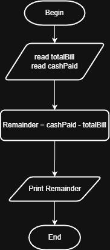

# Problem #39: Pay Remainder

## 📝 Problem Description

Write a program that asks the user to enter the **Total Bill** and the **Total Paid** amount. The program should calculate the remainder (the change) to be given back to the customer.

**Example:**

- Total Bill: `450.50`
- Total Paid: `500`
- **Output:** `Remainder = 49.50`

---

## 🛠️ Algorithm Steps (Logic)

This is a simple subtraction problem, but it is fundamental for any Point of Sale (POS) system:

1. **Input:** Ask the user to enter `TotalBill`.
2. **Input:** Ask the user to enter `TotalPaid`.
3. **Read:** Store both values.
4. **Decision (Validation):** - Check if `TotalPaid < TotalBill`.
   - **Yes:** Print "Paid amount is not enough".
   - **No:** Proceed to step 5.
5. **Calculation:** `Remainder = TotalPaid - TotalBill`.
6. **Output:** Print the `Remainder`.

---

## 📊 Flowchart Logic

1. **Start**
2. **Input:** `Read TotalBill, TotalPaid`
3. **Decision (Diamond):** `Is TotalPaid < TotalBill?`
   - **Yes:** `Print "Insufficient Funds"` -> **End**
   - **No:** - `Remainder = TotalPaid - TotalBill`
     - `Print Remainder`
4. **End**

---

## 🖼️ Solution

