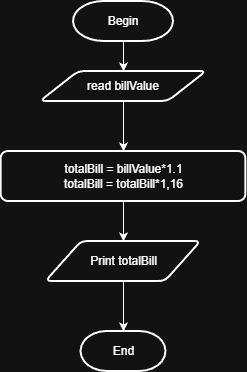

# Problem #40: Service Fee and Sales Tax

## 📝 Problem Description

A restaurant charges **10%** for Service Fee and **16%** for Sales Tax. Write a program that asks the user to enter the **Bill Value** and outputs the **Total Bill** after adding these charges.

**Example:**

- Bill Value: `100`
- Service Fee (10%): `10`
- Bill After Service: `110`
- Sales Tax (16% of 110): `17.6`
- **Total Bill:** `127.6`

---

## 🛠️ Algorithm Steps (Logic)

The important logic here is that taxes are usually calculated on the bill **after** adding the service fee (Total = Bill *1.10* 1.16):

1. **Input:** Ask the user to enter `BillValue`.
2. **Read:** Store the value.
3. **Processing (Step 1):** `TotalBill = BillValue * 1.10` (Adding 10% Service Fee).
4. **Processing (Step 2):** `TotalBill = TotalBill * 1.16` (Adding 16% Sales Tax).
5. **Output:** Print the final `TotalBill`.

---

## 📊 Flowchart Logic

1. **Start**
2. **Input:** `Read BillValue`
3. **Calculation 1:** `TotalBill = BillValue * 1.1`
4. **Calculation 2:** `TotalBill = TotalBill * 1.16`
5. **Output:** `Print TotalBill`
6. **End**

---

## 🖼️ Solution

