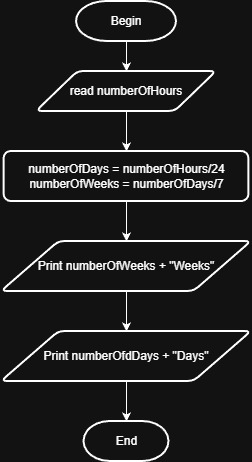

# Problem #41: Weeks, Days, and Hours

## 📝 Problem Description

Write a program that asks the user to enter the **Number of Hours**, then calculates and prints how many **Weeks**, **Days**, and **Remaining Hours** they represent.

**Example:**
- Input: `190` Hours
- Output:
  - `1 Week`
  - `0 Days`
  - `22 Hours`

---

## 🛠️ Algorithm Steps (Logic)

To solve this, we use **Integer Division** (to get the whole number) and **Modulo** (to get the remainder):

1. **Input:** Ask the user to enter `NumberOfHours`.
2. **Read:** Store the value.
3. **Processing (Weeks):**
   - `NumberOfWeeks = NumberOfHours / (24 * 7)`
   - `Remainder = NumberOfHours % (24 * 7)`
4. **Processing (Days):**
   - `NumberOfDays = Remainder / 24`
   - `RemainingHours = Remainder % 24`
5. **Output:** Print `Weeks`, `Days`, and `Hours`.

---

## 📊 Flowchart Logic

1. **Start**
2. **Input:** `Read NumberOfHours`
3. **Calculation:** - `Weeks = NumberOfHours / 168` (since 24 * 7 = 168)
   - `Temp = NumberOfHours % 168`
   - `Days = Temp / 24`
   - `Hours = Temp % 24`
4. **Output:** `Print Weeks, Days, Hours`
5. **End**

---

## 🖼️ Solution

