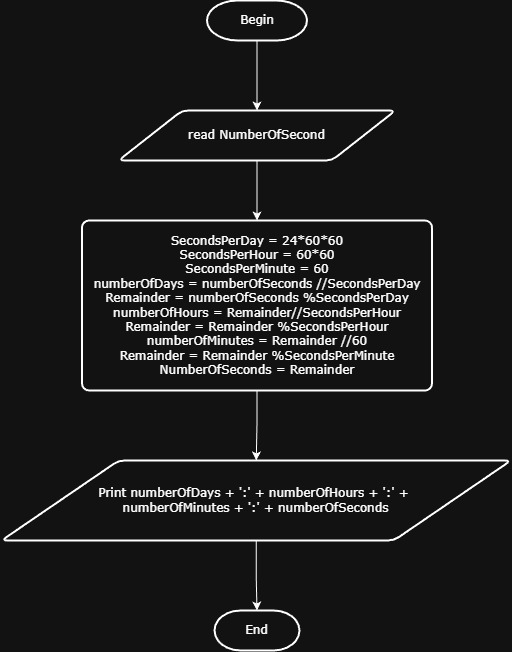

# Problem #43: Seconds to Days, Hours, Minutes, and Seconds

## 📝 Problem Description

Write a program that inputs a total number of **Seconds** and converts it into its equivalent duration in **Days, Hours, Minutes, and Seconds**.

**Example:**

- **Input:** `95000` Seconds
- **Output:** - `1` Day
  - `2` Hours
  - `23` Minutes
  - `20` Seconds

---

## 🛠️ Algorithm Steps (Logic)

To solve this, we use the constants:

- 1 Day = 86,400 Seconds ($60 \times 60 \times 24$)
- 1 Hour = 3,600 Seconds ($60 \times 60$)
- 1 Minute = 60 Seconds

1. **Input:** Read `TotalSeconds`.
2. **Calculate Days:**
   - `Days = TotalSeconds / 86400` (Integer Division)
   - `Remainder = TotalSeconds % 86400`
3. **Calculate Hours:**
   - `Hours = Remainder / 3600`
   - `Remainder = Remainder % 3600`
4. **Calculate Minutes:**
   - `Minutes = Remainder / 60`
   - `Seconds = Remainder % 60`
5. **Output:** Print Days, Hours, Minutes, and Seconds.

---

## 📊 Time Complexity

The complexity is **$O(1)$** because the number of operations is constant regardless of the input size.

---

## 📈 Flowchart Logic

1. **Start**
2. **Input:** `Read TotalSeconds`
3. **Process 1 (Days):** - `Days = Floor(TotalSeconds / 86400)`
   - `Remainder = TotalSeconds MOD 86400`
4. **Process 2 (Hours):**
   - `Hours = Floor(Remainder / 3600)`
   - `Remainder = Remainder MOD 3600`
5. **Process 3 (Minutes/Seconds):**
   - `Minutes = Floor(Remainder / 60)`
   - `Seconds = Remainder MOD 60`
6. **Output:** `Print Days:Hours:Minutes:Seconds`
7. **End**

## Solution

