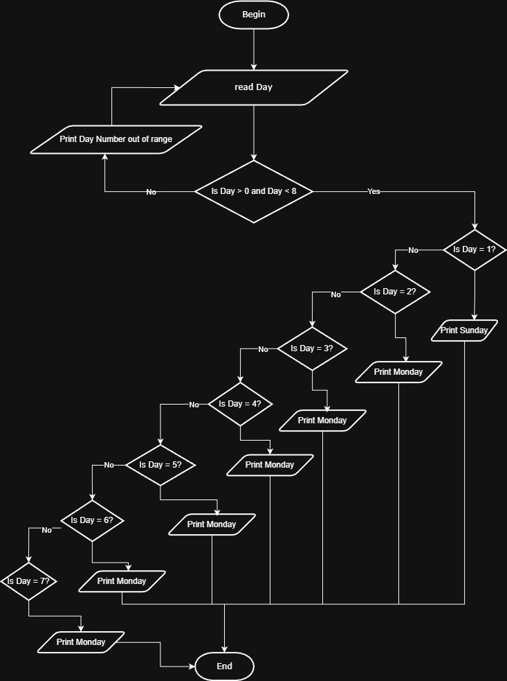

# Problem #44: Day of the Week

## 📝 Problem Description

Write a program that asks the user to enter a number (from 1 to 7) representing the **Day of the Week**, and the program should print the corresponding day name.

**Example:**

- **Input:** `1` -> **Output:** `Sunday`
- **Input:** `5` -> **Output:** `Thursday`
- **Input:** `9` -> **Output:** `Wrong Day`

---

## 🛠️ Algorithm Steps (Logic)

The goal is to match a numeric input to a string (text) value.

1. **Input:** Read `DayNumber`.
2. **Decision (Multi-Condition):**
   - If `Day == 1`: Print "Sunday"
   - Else if `Day == 2`: Print "Monday"
   - Else if `Day == 3`: Print "Tuesday"
   - Else if `Day == 4`: Print "Wednesday"
   - Else if `Day == 5`: Print "Thursday"
   - Else if `Day == 6`: Print "Friday"
   - Else if `Day == 7`: Print "Saturday"
   - Else: Print "Wrong Day"
3. **Output:** Display the result.

---

## 📊 Time Complexity

The complexity is **$O(1)$** because it is a fixed set of comparisons regardless of the input.

---

## 📈 Flowchart Logic

1. **Start**
2. **Input:** `Read Day`
3. **Decision (Switch/If Chain):**
   - `Case 1`: `Print "Sunday"` -> **End**
   - `Case 2`: `Print "Monday"` -> **End**
   - `Case 3`: `Print "Tuesday"` -> **End**
   - `Case 4`: `Print "Wednesday"` -> **End**
   - `Case 5`: `Print "Thursday"` -> **End**
   - `Case 6`: `Print "Friday"` -> **End**
   - `Case 7`: `Print "Saturday"` -> **End**
   - `Default`: `Print "Wrong Day"` -> **End**
4. **End**

## Solution

