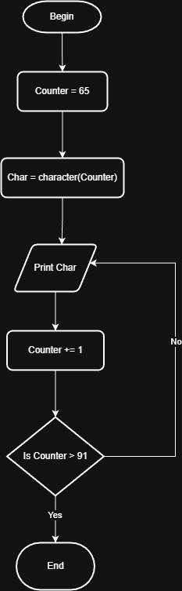

# Problem #46: Print Letters from A to Z

## 📝 Problem Description

Write a program that prints all the letters of the alphabet from **A** to **Z**.

**Example:**

- **Output:** `A B C D E F G H I J K L M N O P Q R S T U V W X Y Z`

---

## 🛠️ Algorithm Steps (Logic)

To solve this, we rely on the fact that computers store characters as numbers (ASCII). The letter 'A' is represented by the number **65**, and 'Z' is **90**.

1. **Initialization:** Set a counter `i = 65` (Decimal value for 'A').
2. **Loop/Decision:**
   - Check if `i <= 90` (Decimal value for 'Z').
   - **Yes (True):**
     - Convert the number `i` to its character equivalent.
     - Print the character.
     - Increment `i = i + 1`.
     - Repeat the loop.
   - **No (False):** End the program.

---

## 📊 ASCII Insight

Every character has a numeric code. By looping through numbers, we can print characters:

- **65** = 'A'
- **66** = 'B'
- ...
- **90** = 'Z'

---

## 📈 Flowchart Logic

1. **Start**
2. **Process:** `i = 65`
3. **Loop Diamond:** `Is i <= 90?`
   - **No:** -> **End**
   - **Yes:**
     - `Print Char(i)`
     - `i = i + 1`
     - (Arrow goes back to the Loop Diamond)
4. **End**

## Solution

