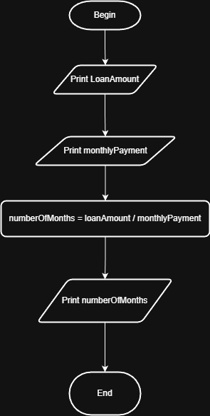

# Problem #47: Loan Calculator

## 📝 Problem Description

Write a program that asks the user to enter:

1. **Loan Amount** (The total money borrowed).
2. **Monthly Installment** (The amount paid every month).

The program should calculate and print the total number of **Months** required to settle the loan.

**Example:**

- **Loan Amount:** `5000`
- **Monthly Payment:** `500`
- **Output:** `10 Months`

---

## 🛠️ Algorithm Steps (Logic)

This is a simple division problem. We need to find out how many times the monthly payment fits into the total loan.

1. **Input:** Read `LoanAmount` and `MonthlyInstallment`.
2. **Calculation:**
   - `TotalMonths = LoanAmount / MonthlyInstallment`
3. **Output:** Print `TotalMonths`.

---

## 📊 Performance Insight

This calculation is **$O(1)$** (Constant Time) because it involves a single mathematical operation regardless of how large the loan is.

---

## 📈 Flowchart Logic

1. **Start**
2. **Input:** `Read LoanAmount, MonthlyInstallment`
3. **Decision (Validation):** `Is MonthlyInstallment > 0?`
   - **No:** Print "Installment must be greater than zero".
   - **Yes:** - `TotalMonths = LoanAmount / MonthlyInstallment`
4. **Output:** `Print TotalMonths`
5. **End**

## Solution

