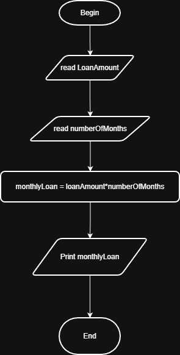

# Problem #48: Monthly Installment Amount

## 📝 Problem Description

Write a program that asks the user to enter:

1. **Total Loan Amount**
2. **Number of Months** (The period to pay back the loan)

The program should calculate and print the **Monthly Installment Amount**.

**Example:**

- **Total Loan Amount:** `5000`
- **Months:** `10`
- **Output:** `500`

---

## 🛠️ Algorithm Steps (Logic)

To find the monthly payment, we simply divide the total debt by the number of months.

1. **Input:** Read `LoanAmount` and `HowManyMonths`.
2. **Read:** Store the values in variables.
3. **Processing:**
   - `MonthlyInstallment = LoanAmount / HowManyMonths`
4. **Output:** Print the `MonthlyInstallment`.

---

## 📊 Performance Insight

This is an **$O(1)$** (Constant Time) operation. The computer performs a single division regardless of whether the loan is $10$ or $10,000,000$.

---

## 📈 Flowchart Logic

1. **Start**
2. **Input:** `Read LoanAmount, HowManyMonths`
3. **Calculation:**
   - `Result = LoanAmount / HowManyMonths`
4. **Output:** `Print Result`
5. **End**

## Solution

