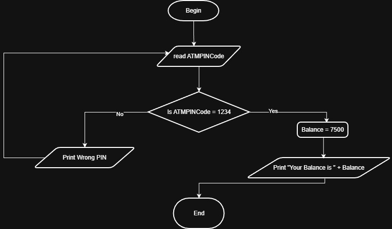

# Problem #49: ATM PIN Code

## 📝 Problem Description

Write a program that simulates an ATM PIN check. The program should:

1. Ask the user to enter a **PIN Code**.
2. If the PIN is **1234**, print "Your Account Balance is 7500".
3. If the PIN is wrong, print "Wrong PIN" and ask the user to enter it again.

**Example:**

- **Input:** `5555` -> **Output:** `Wrong PIN` (Ask again)
- **Input:** `0000` -> **Output:** `Wrong PIN` (Ask again)
- **Input:** `1234` -> **Output:** `Your Account Balance is 7500`

---

## 🛠️ Algorithm Steps (Logic)

This is a **Conditional Loop** (While Loop) because we don't know how many times the user will fail.

1. **Input:** Read `PIN`.
2. **Loop/Decision:** - While `PIN != "1234"`:
     - Print "Wrong PIN".
     - **Input:** Read `PIN` again.
3. **Exit Loop:** If the loop breaks (meaning the PIN is correct):
   - Print "Your Account Balance is 7500".

---

## 📊 Performance Insight

The time complexity is **$O(N)$**, where $N$ is the number of attempts the user takes to enter the correct PIN. In a real system, $N$ is usually limited to 3 attempts for security.

---

## 📈 Flowchart Logic

1. **Start**
2. **Input:** `Read PIN`
3. **Decision (Diamond):** `Is PIN == "1234"?`
   - **No:** - `Print "Wrong PIN"`
     - Go back to `Read PIN`.
   - **Yes:**
     - `Print "Your Account Balance is 7500"`
4. **End**

## Solution

