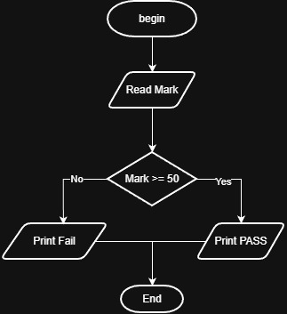

# Problem #8: Pass/Fail (Algorithm & Flowchart)

## 📝 Problem Description

Write a program that asks the user to enter their **Mark**. Based on the input, the program should determine if the student has **Passed** or **Failed**.

### Logic

* The student **Passes** if the mark is **greater than or equal to 50**.
* The student **Fails** if the mark is **less than 50**.

---

## 🚀 Algorithm Steps

1. **Input:** Ask the user to enter their `Mark`.
2. **Comparison:** Check if `Mark >= 50`.
3. **Decision:**

   * If **True**: Print "PASS".

   * If **False**: Print "FAIL".
4. **End:** Terminate the program.

---

## 📊 Flowchart Logic

