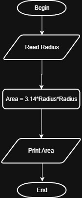

# Problem #18: Circle Area

## 📝 Problem Description

Write a program to calculate circle area and print it on the screen.

**Example:**

- If the radius (r) is: `5`
- The Output will be: `78.54` (approximately)

---

## 🛠️ Algorithm Steps (Logic)

The area of a circle is calculated using the radius squared multiplied by Pi ($\pi$):

1. **Input:** Ask the user to enter the radius `r`.
2. **Read:** Store the value in variable `r`.
3. **Processing:** - Calculate the area using the formula: $Area = \pi * r^2$
   - Note: You can use $\pi \approx 3.14159$.
4. **Output:** Print the `Area`.

---

## 📊 Flowchart Logic

1. **Start**
2. **Input:** `Read r`
3. **Process:** `Area = PI * r^2`
4. **Output:** `Print Area`
5. **End**

---

## 🖼️ Solution

