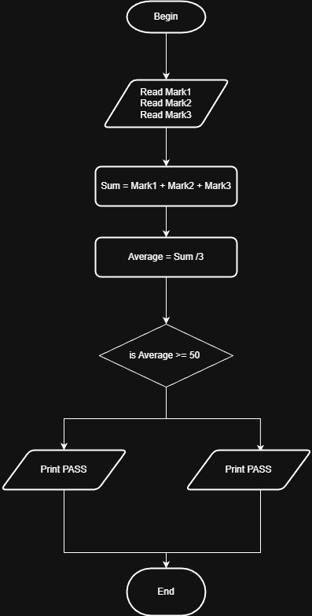

# Problem #11: Average Pass Fail

## 📝 Problem Description

Write a program to ask the user to enter three marks (e.g., Mark1, Mark2, Mark3). The program should calculate their **Average** and check if the student has **Passed** (Average >= 50) or **Failed** (Average < 50).

**Example:**

- If the user enters: `90`, `80`, and `70`
- The Average is: `80`
- The Output will be: `80` followed by `PASS`

---

## 🛠️ Algorithm Steps (Logic)

This problem builds upon previous logic by adding a decision step after the calculation:

1. **Input:** Ask the user to enter three marks.
2. **Read:** Store the values in variables (e.g., `Mark1`, `Mark2`, `Mark3`).
3. **Processing:** - Create a variable named `Average`.
   - Calculate the average using the formula: `Average = (Mark1 + Mark2 + Mark3) / 3`.
4. **Decision:**
   - Check if the `Average` is greater than or equal to `50`.
5. **Output:** - Print the `Average`.
   - If the decision is **Yes**, print `PASS`.
   - If the decision is **No**, print `FAIL`.

---

## 📊 Flowchart Logic

1. **Start**
2. **Input:** `Read Mark1, Mark2, Mark3`
3. **Process:** `Average = (Mark1 + Mark2 + Mark3) / 3`
4. **Output:** `Print Average`
5. **Decision (Diamond Shape):** Is `Average >= 50`?
   - **Yes:** `Print "PASS"`
   - **No:** `Print "FAIL"`
6. **End**

---

## 🖼️ Solution Visual

