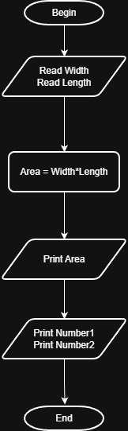

# Problem #15: Rectangle Area

## 📝 Problem Description

Write a program to calculate the area of a rectangle and print it on the screen.

**Example:**

- If the width is: `10` and the length is: `20`
- The Output will be: `200`

---

## 🛠️ Algorithm Steps (Logic)

To calculate the area of a rectangle, you need to multiply its length by its width:

1. **Input:** Ask the user to enter the rectangle width and length.
2. **Read:** Store the values in variables (e.g., `Width`, `Length`).
3. **Processing:** - Create a variable named `Area`.
   - Use the formula: `Area = Width * Length`.
4. **Output:** Print the value of the `Area` variable.

---

## 📊 Flowchart Logic

1. **Start**
2. **Input:** `Read Width, Length`
3. **Process:** `Area = Width * Length`
4. **Output:** `Print Area`
5. **End**

---

## 🖼️ Solution

