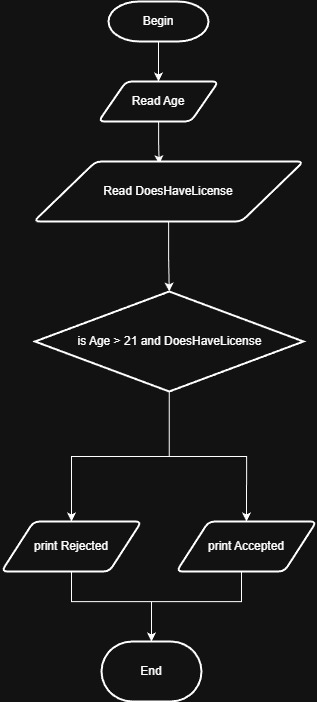

# Problem #4: Check Age and Driver License

## 📝 Problem Description

Write a program that asks the user to enter their **Age** and whether they have a **Driver License**. The program should print "Accepted" only if the age is greater than 21 AND the user has a driver license, otherwise print "Rejected".

**Example:**

- Age: `25`, License: `True` -> Output: `Accepted`
- Age: `18`, License: `True` -> Output: `Rejected`
- Age: `30`, License: `False` -> Output: `Rejected`

---

## 🛠️ Algorithm Steps (Logic)

To be accepted, two conditions must be met simultaneously:

1. **Input:** Ask the user to enter their `Age` and `HasLicense` (Yes/No).
2. **Read:** Store the values in variables.
3. **Decision:** Check if `Age > 21` AND `HasLicense == true`.
4. **Output:** - If both are true: Print "Accepted".
   - Otherwise: Print "Rejected".

---

## 📊 Flowchart Logic

1. **Start**
2. **Input:** `Read Age, HasLicense`
3. **Decision (Diamond):** `Is Age > 21 AND HasLicense == true?`
   - **Yes:** `Print "Accepted"`
   - **No:** `Print "Rejected"`
4. **End**

---

## 🖼️ Solution

