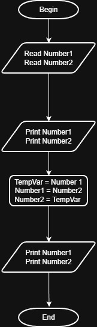

# Problem #14: Swap Numbers

## 📝 Problem Description

Write a program that asks the user to enter two numbers. The program should first print the two numbers in the order they were entered, then swap their values (put the first in the second and the second in the first), and finally print them again after the swap.

**Example:**

- If the user enters: `10` and `20`
- Output before swap: `10, 20`
- Output after swap: `20, 10`

---

## 🛠️ Algorithm Steps (Logic)

To swap two values, we need a "Temporary" storage (like a third empty plate) to hold one value while we move the other:

1. **Input:** Ask the user to enter two numbers (`Num1`, `Num2`).
2. **Read:** Store the values in variables.
3. **Print:** Display the numbers before the swap.
4. **Processing (Swapping):**
   - Create a temporary variable (e.g., `Temp`).
   - Step 1: `Temp = Num1` (Store the first number in the temporary container).
   - Step 2: `Num1 = Num2` (Move the second number to the first container).
   - Step 3: `Num2 = Temp` (Move the value from the temporary container to the second container).
5. **Output:** Print the values of `Num1` and `Num2` after the swap.

---

## 📊 Flowchart Logic

1. **Start**
2. **Input:** `Read Num1, Num2`
3. **Output:** `Print Num1, Num2`
4. **Process:** - `Temp = Num1`
   - `Num1 = Num2`
   - `Num2 = Temp`
5. **Output:** `Print Num1, Num2`
6. **End**

---

## 🖼️ Solution

