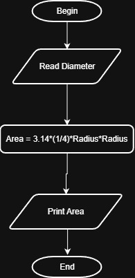

# Problem #19: Circle Area Through Diameter

## 📝 Problem Description

Write a program to calculate circle area through diameter and print it on the screen.

**Example:**

- If the diameter (D) is: `10`
- The Output will be: `78.54`

---

## 🛠️ Algorithm Steps (Logic)

To calculate the area using the diameter, we use a variation of the circle area formula:

1. **Input:** Ask the user to enter the diameter `D`.
2. **Read:** Store the value in variable `D`.
3. **Processing:** - Calculate the area using the formula: $Area = \frac{\pi * D^2}{4}$
   - Note: This is equivalent to finding the radius ($r = D/2$) and then calculating $\pi r^2$.
4. **Output:** Print the `Area`.

---

## 📊 Flowchart Logic

1. **Start**
2. **Input:** `Read D`
3. **Process:** `Area = (PI * D^2) / 4`
4. **Output:** `Print Area`
5. **End**

---

## 🖼️ Solution

