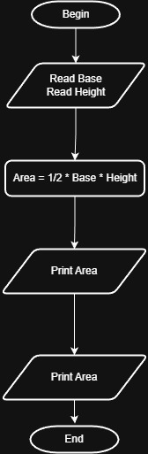

# Problem #17: Triangle Area

## 📝 Problem Description

Write a program to calculate the triangle area and print it on the screen.

**Example:**

- If the base (a) is: `10` and the height (h) is: `8`
- The Output will be: `40`

---

## 🛠️ Algorithm Steps (Logic)

The area of a triangle is calculated by multiplying half of the base by the height:

1. **Input:** Ask the user to enter triangle base `a` and height `h`.
2. **Read:** Store the values in variables `a` and `h`.
3. **Processing:** - Calculate the area using the formula: $Area = \frac{1}{2} * a * h$
4. **Output:** Print the `Area`.

---

## 📊 Flowchart Logic

1. **Start**
2. **Input:** `Read a, h`
3. **Process:** `Area = 1/2 * a * h`
4. **Output:** `Print Area`
5. **End**

---

## 🖼️ Solution

