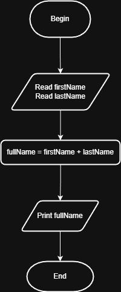

# FullName (Problem #6)

---

## Problem Description

This algorithm is designed to take two separate names from the user (Fisrst Name and Last Name) and merge them into one single string representing the Full Name.

## Algorithm Steps

The process follows a simple sequence to achieve the result:

* **Step 1:** Ask the user to input the First Name.
* **Step 2:** Ask the user to input the Last Name.
* **Step 3:** Perform String Concatenation by joining the First Name, a space, and the Last Name.
* **Step 4:** Print the final Full Name on the screen.

---

## Logical Formula

The core logic of this program is based on the following expression:
`FullName = FirstName + " " + LastName`

Note: Adding the space `" "` between the names is essential to ensure they are not merged directly into one word.

---

## Input Data

* **FirstName:** String
* **LastName:** String

## Output

* **FullName:** The complete name string displayed to the user.

---

## Solution

