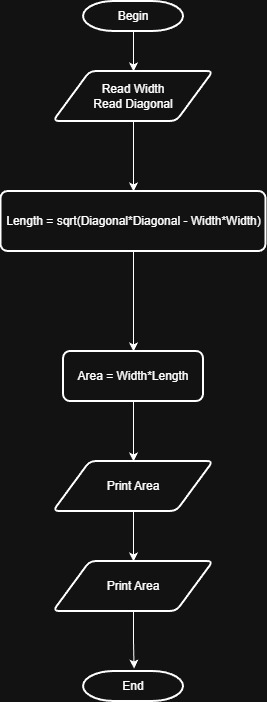

# Problem #16: Rectangle Area Through Diagonal and Side

## 📝 Problem Description

Write a program to calculate rectangle area through diagonal and side area of rectangle and print it on the screen.

**Example:**

- If the side (a) is: `5` and the diagonal (d) is: `13`
- The Output will be: `60`

---

## 🛠️ Algorithm Steps (Logic)

To find the area using a side and the diagonal, we first find the other side using Pythagoras' theorem, then multiply the two sides:

1. **Input:** Ask the user to enter side `a` and diagonal `d`.
2. **Read:** Store the values in variables `a` and `d`.
3. **Processing:** - Calculate the second side `b` using the formula: $b = \sqrt{d^2 - a^2}$
   - Calculate the `Area` using: $Area = a * b$
4. **Output:** Print the `Area`.

---

## 📊 Flowchart Logic

1. **Start**
2. **Input:** `Read a, d`
3. **Process:** `Area = a * sqrt(d^2 - a^2)`
4. **Output:** `Print Area`
5. **End**

---

## 🖼️ Solution

