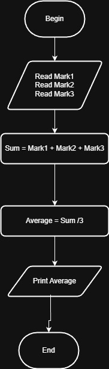

# Problem #10: Average of 3 Marks

## 📝 Problem Description

Write a program to ask the user to enter three marks (e.g., Mark1, Mark2, Mark3) and then print their **Average** on the screen.

**Example:**

- If the user enters: `90`, `80`, and `70`
- The Output will be: `80`

---

## 🛠️ Algorithm Steps (Logic)

To calculate the average, you must sum the marks first and then divide the total by the number of marks (which is 3 in this case):

1. **Input:** Ask the user to enter three marks.
2. **Read:** Store the values in variables (e.g., `Mark1`, `Mark2`, `Mark3`).
3. **Processing:** - Create a variable named `Average`.
   - Use the formula: `Average = (Mark1 + Mark2 + Mark3) / 3`.
   - *Note: Parentheses are crucial to ensure the sum happens before the division.*
4. **Output:** Print the value of the `Average` variable.

---

## 📊 Flowchart Logic

1. **Start**
2. **Input:** `Read Mark1, Mark2, Mark3`
3. **Process:** `Average = (Mark1 + Mark2 + Mark3) / 3`
4. **Output:** `Print Average`
5. **End**

---

## 🖼️ Solution Visual

