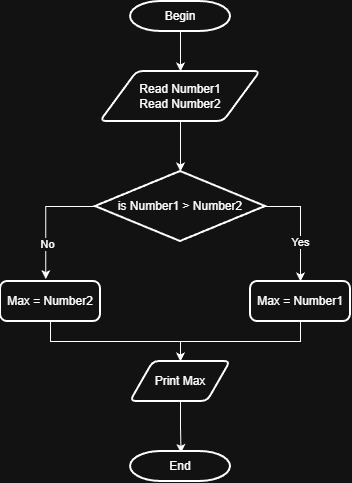

# Problem #13: Max of 3 Numbers

## 📝 Problem Description

Write a program to ask the user to enter three numbers (e.g., A, B, C) and then print the **Maximum** (largest) number on the screen.

**Example:**

- If the user enters: `30`, `10`, and `20`
- The Output will be: `30`

---

## 🛠️ Algorithm Steps (Logic)

Finding the maximum of three numbers involves nested comparisons to isolate the largest value:

1. **Input:** Ask the user to enter three numbers (A, B, C).
2. **Read:** Store the values in variables.
3. **Comparison 1:** Compare **A** and **B**.
   - If **A > B**:
     - Compare **A** and **C**.
     - If **A > C**, then **A** is the Max.
     - If **A < C**, then **C** is the Max.
   - If **A < B**:
     - Compare **B** and **C**.
     - If **B > C**, then **B** is the Max.
     - If **B < C**, then **C** is the Max.
4. **Output:** Print the largest number found.

---

## 📊 Flowchart Logic

1. **Start**
2. **Input:** `Read A, B, C`
3. **Decision 1:** `Is A > B?`
   - **If Yes:**
     - **Decision 2:** `Is A > C?`
       - **Yes:** `Print A`
       - **No:** `Print C`
   - **If No:**
     - **Decision 3:** `Is B > C?`
       - **Yes:** `Print B`
       - **No:** `Print C`
4. **End**

---

## 🖼️ Solution

