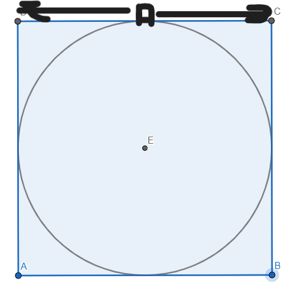
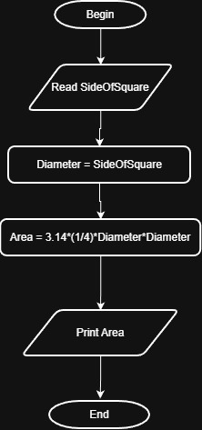

# Problem #20: Circle Area Inscribed in a Square

## 📝 Problem Description

Write a program to calculate circle area inscribed in a square and print it on the screen.

**Example:**

- If the side of the square (A) is: `10`
- The Output will be: `78.54`

---

## 🛠️ Algorithm Steps (Logic)

When a circle is inscribed in a square, the diameter of the circle is equal to the side of the square ($D = A$):

1. **Input:** Ask the user to enter the side length of the square `A`.
2. **Read:** Store the value in variable `A`.
3. **Processing:** - Calculate the area using the formula: $Area = \frac{\pi * A^2}{4}$
   - (Note: This is the same logic as using the diameter).
4. **Output:** Print the `Area`.

---

## 📊 Flowchart Logic

1. **Start**
2. **Input:** `Read A`
3. **Process:** `Area = (PI * A^2) / 4`
4. **Output:** `Print Area`
5. **End**

---

## 🖼️ Solution

