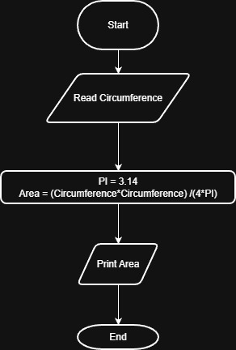

# Problem #21: Circle Area Along the Circumference

## 📝 Problem Description

Write a program to calculate circle area along the circumference and print it on the screen.

**Example:**

- If the circumference (L) is: `20`
- The Output will be: `31.83`

---

## 🛠️ Algorithm Steps (Logic)

To calculate the area using the circumference, we use the relationship between the circumference and the radius:

1. **Input:** Ask the user to enter the circumference `L`.
2. **Read:** Store the value in variable `L`.
3. **Processing:** - Calculate the area using the formula: $Area = \frac{L^2}{4\pi}$
   - (Note: This is derived from $L = 2\pi r$, so $r = L / 2\pi$, then Area = $\pi r^2$).
4. **Output:** Print the `Area`.

---

## 📊 Flowchart Logic

1. **Start**
2. **Input:** `Read L`
3. **Process:** `Area = (L^2) / (4 * PI)`
4. **Output:** `Print Area`
5. **End**

---

## 🖼️ Solution

