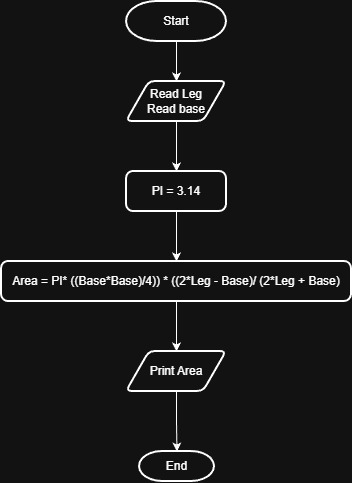

# Problem #22: Circle Area Inscribed in an Isosceles Triangle

## 📝 Problem Description

Write a program to calculate circle area inscribed in an isosceles triangle and print it on the screen.

**Example:**

- If the base (a) is: `20` and the side (b) is: `10`
- The Output will be: `47.12`

---

## 🛠️ Algorithm Steps (Logic)

To calculate the area of a circle inscribed in an isosceles triangle, we use the specific formula involving the base and side lengths:

1. **Input:** Ask the user to enter triangle base `a` and side `b`.
2. **Read:** Store the values in variables `a` and `b`.
3. **Processing:** - Calculate the area using the formula: $Area = \pi * \frac{a^2 * (2b - a)}{4 * (2b + a)}$
4. **Output:** Print the `Area`.

---

## 📊 Flowchart Logic

1. **Start**
2. **Input:** `Read a, b`
3. **Process:** `Area = PI * ( (a^2 * (2*b - a)) / (4 * (2*b + a)) )`
4. **Output:** `Print Area`
5. **End**

---

## 🖼️ Solution

